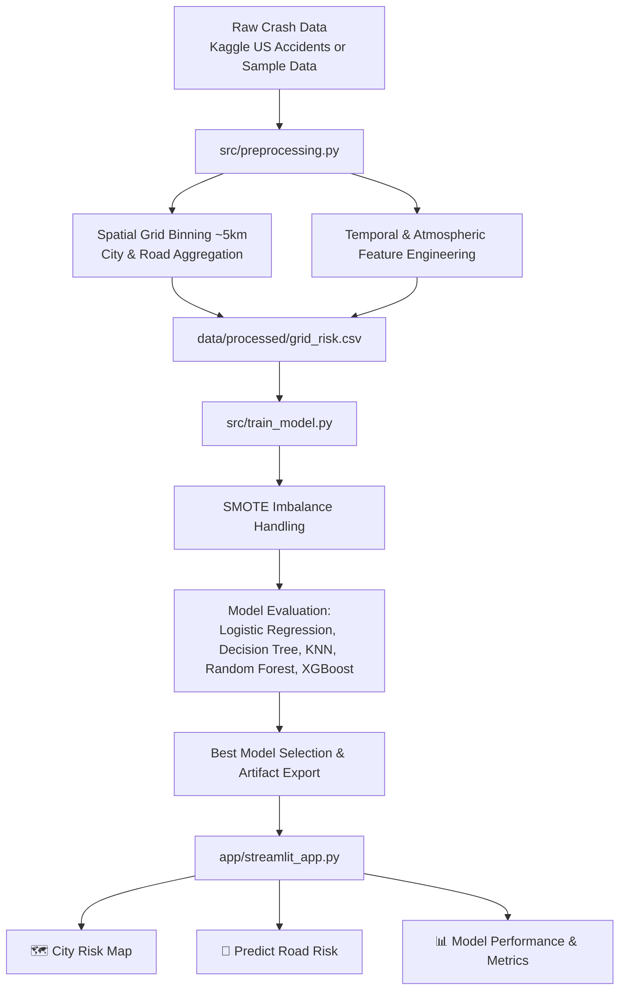

# 🚧 Road Accident Risk Prediction System

A proactive machine learning system that classifies road corridors into **Low**, **Medium**, and **High Risk (Red Alert)** zones based on historical crash data, road infrastructure (junctions, signals, crossings), and atmospheric conditions.

Built with **Python**, **Scikit-Learn**, **XGBoost**, **Folium**, and **Streamlit**.

---

## 🌟 Why This Project?

Most traditional accident-related machine learning models focus on **post-crash severity** (predicting whether an accident that *already happened* was minor or fatal). While academically interesting, this is purely **reactive**.

**This project takes a proactive approach**:
- It evaluates road segments and intersections *before* crashes occur.
- It identifies recurring physical and atmospheric vulnerability patterns.
- It provides actionable intelligence for city traffic engineers (signage, patrol dispatch, signal timing) and everyday commuters (route hazard warnings).

---

## 🏗️ System Architecture



---

## 🛡️ Preventing Target Leakage

> [!NOTE]
> In early prototype iterations, models trained with raw crash counts yielded an artificial **0.99 Macro F1** score.
> Analysis revealed that `AccidentCount` and `AvgSeverity` were inadvertently included as input features while simultaneously defining the target label (`Risk_Level`).
> 
> We resolved this by strictly restricting input attributes to **independent road layout, temporal, and atmospheric features**:
> - **Road Infrastructure**: Junction, Traffic Signal, Pedestrian Crossing.
> - **Temporal Patterns**: Rush Hour peaks, Weekend driving.
> - **Atmospheric Conditions**: Visibility, Wind Speed, Precipitation, Bad Weather indicators.
>
> The honest, un-leaked **Macro F1 score is ~0.49** (with XGBoost), representing a robust and reliable real-world baseline.

---

## 🚀 Key Dashboard Modules

### 1. 🗺️ City Risk Map
- Filter road segments across major metropolitan areas (**Atlanta, Dallas, Chicago, Los Angeles, Houston, Charlotte, Miami**).
- Interactive Folium map displaying:
  - 🔴 **High Risk (Red Alert)**: Critical accident hotspots.
  - 🟠 **Medium Risk**: Moderate traffic conflict zones.
  - 🟢 **Low Risk**: Standard safety profile segments.
- **Top Dangerous Corridors Table**: Displays ranked high-risk roads with accident frequency and dominant hazard factors.

### 2. 🔮 Predict Road Risk
- Intuitive user controls for road infrastructure (Junction, Traffic Signal, Crosswalk), time of travel (Rush Hour, Weekend), and weather conditions (Clear, Rain, Fog, Snow).
- Predicts risk classification (**Low / Medium / High**) along with model confidence probability distribution.

### 3. 📊 Model Performance & Metrics
- Multi-model evaluation leaderboard comparing **Macro F1 scores** across Logistic Regression, Decision Tree, KNN, Random Forest, and XGBoost.
- Technical architecture summary outlining classification formulation, SMOTE balancing, and spatial binning.

---

## 📊 Model Comparison Benchmark

| Model | Test Macro F1 | Train/Test Gap | Notes |
|---|---|---|---|
| **XGBoost (Champion)** | **~0.4908** | ~0.46 | Handled non-linear weather/infrastructure interactions best |
| **Random Forest** | ~0.4069 | ~0.42 | Good recall on High Risk minority class |
| **Logistic Regression** | ~0.4217 | ~0.13 | High generalization stability, linear baseline |
| **K-Nearest Neighbors** | ~0.4064 | ~0.24 | Sensitive to local density variations |
| **Decision Tree** | ~0.3510 | ~0.36 | High interpretability, lower multi-class precision |

---

## 💻 Quickstart: How to Run

### 1. Setup Virtual Environment
```bash
# Clone or navigate to the directory
cd road-accident-risk-predictor

# Create and activate virtual environment
python -m venv .venv
.venv\Scripts\activate        # Windows
# source .venv/bin/activate   # Linux/macOS

# Install dependencies
pip install -r requirements.txt
```

### 2. Generate Sample Data & Train
```bash
# 1. Generate realistic multi-city crash dataset
python src/generate_sample_data.py

# 2. Preprocess, clean, and aggregate spatial grid risk
python src/preprocessing.py

# 3. Train all 5 models with SMOTE and export artifacts
python src/train_model.py
```

### 3. Launch Dashboard
```bash
streamlit run app/streamlit_app.py
```

---

## 🌐 Using the Full Kaggle "US Accidents" Dataset

To scale this system to the full 7.7 million record Kaggle dataset:
1. Download `US_Accidents_March23.csv` from [Kaggle US Accidents](https://www.kaggle.com/datasets/sobhanmoosavi/us-accidents).
2. Save it at `data/raw/US_Accidents.csv`.
3. Run:
   ```bash
   python src/preprocessing.py --input data/raw/US_Accidents.csv --output data/processed/grid_risk.csv
   python src/train_model.py --input data/processed/grid_risk.csv
   ```
*(Note: For machines with 8GB RAM, you can add `nrows=400000` to `pd.read_csv()` in `preprocessing.py` for high statistical significance with low memory overhead).*
